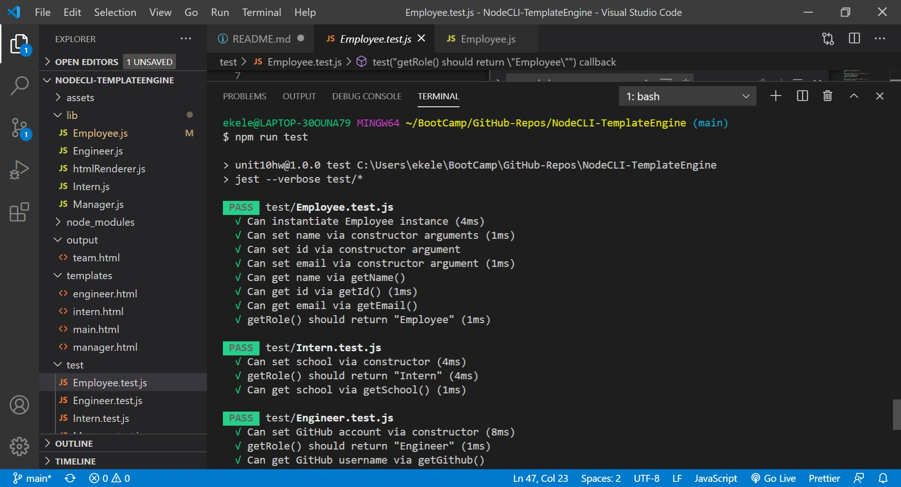
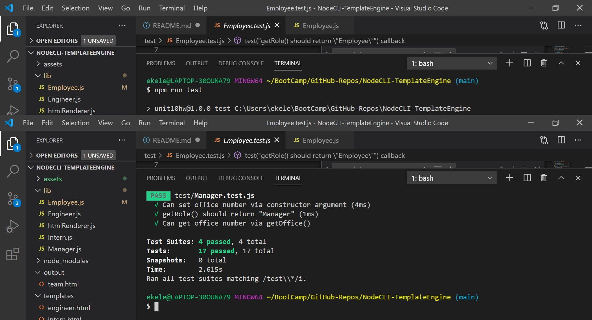
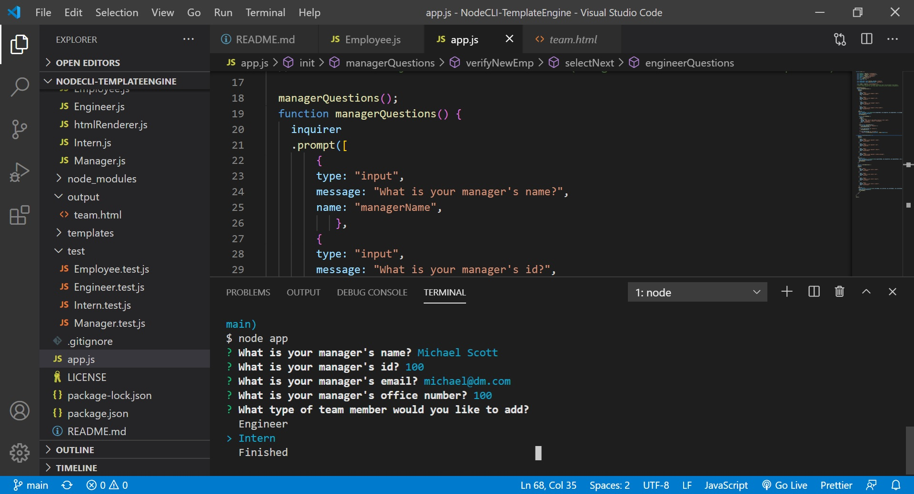
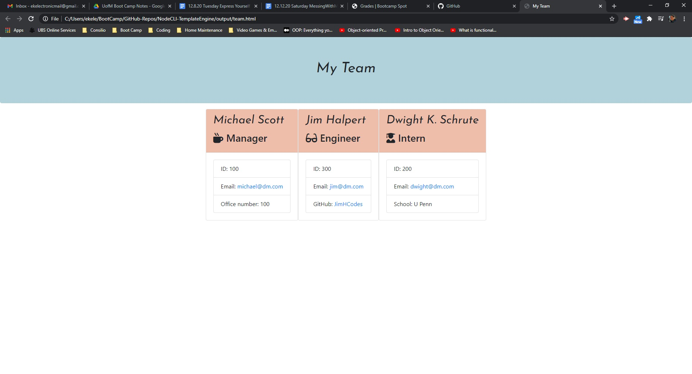

# NodeCLI-TemplateEngine

[Here is a link to the video for Graders](https://youtu.be/RKQtEu0Da1Y)

## Table of Contents:

1. [Description](#description)
2. [Installation](#Installation)
3. [Usage](#Usage)
4. [Contributing](#Contributing)
5. [Tests](#Tests)
6. [License](#License)
7. [GitHub](#GitHub)
8. [E-mail](#E-mail)

## Description

A Node.js Template Engine that forms a directory of work team members. The Template Engine's code utilizes Object Oriented Programming. The project also contains a test directory contining test.js files that utilize Jest.

Sceenshots

## Installation

The Template Engine requires installation of Node.js. Dependencies include Inquirer, and Jest for testing. Users must also have access to a IDE such as Visual Studio Code with access to the terminal or access to GitBash/Command Line Interface to run Node.

## Usage

To use the Template Engine, install and run: "node app.js" in the terminal, and answer the prompts. After the prompts are answered, open the team.html file from the "output" directory.

## Contributing

Pull requests are welcome. For major changes, please open an issue first to discuss what you would like to change.

## Tests

Please make sure to update tests as appropriate.

## License

## GitHub

EsmondKim (https://github.com/EsmondKim)

## E-mail

ekelectronicmail@gmail.com

## Link to Video

[Here is a link to the video](https://youtu.be/RKQtEu0Da1Y)
